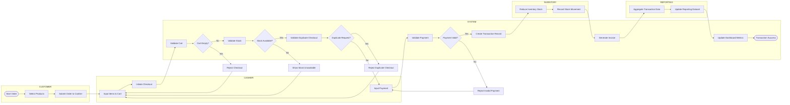
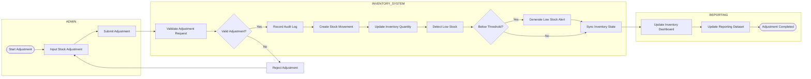
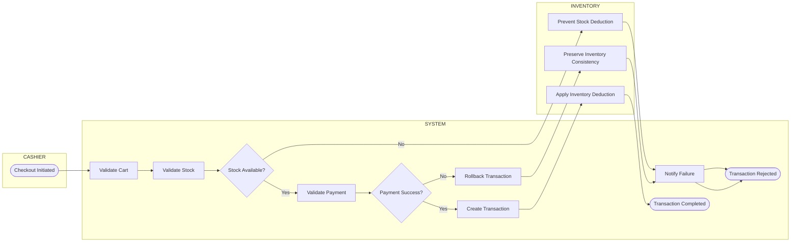
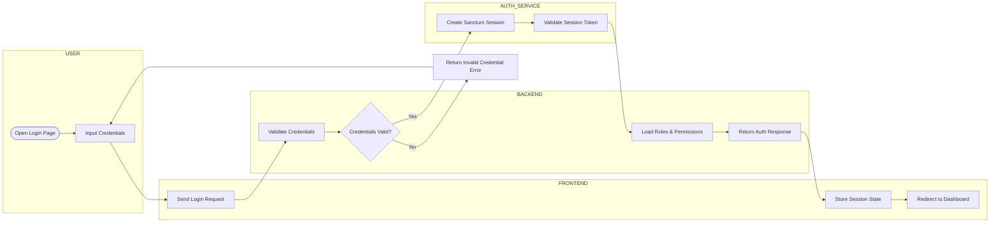
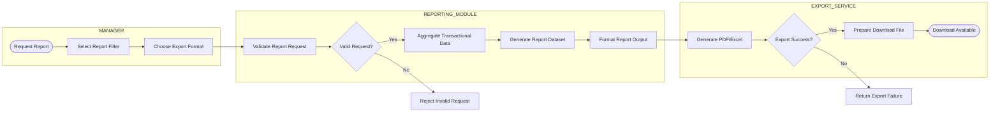

# ELKash ERP BPMN Documentation

## Document Information

| Item           | Description                                |
| -------------- | ------------------------------------------ |
| Project Name   | ELKash ERP                                 |
| Document Type  | BPMN (Business Process Model and Notation) |
| System Type    | Modular ERP + POS                          |
| Industry       | Cafe / Coffee Shop / Restaurant            |
| Architecture   | Nuxt 3 + Laravel REST API                  |
| Database       | PostgreSQL (Supabase)                      |
| Authentication | Laravel Sanctum                            |
| BPMN Level     | Mid-Level BPMN                             |
| Version        | V1                                         |

---

# BPMN ENGINEERING PRINCIPLES

BPMN dirancang berdasarkan prinsip:

* business workflow integrity
* operational consistency
* transaction reliability
* inventory synchronization
* modular ERP interaction
* scalable business architecture

BPMN menggunakan:

* swimlane representation
* decision gateway
* validation flow
* exception handling
* transactional lifecycle approach

---

# 1. BPMN — POS Transaction Flow

## Objective

Mengelola transaksi POS secara konsisten dengan validasi stok, payment confirmation, inventory synchronization, invoice generation, dan reporting update.

---

## Actors / Swimlanes

| Swimlane  | Responsibility                   |
| --------- | -------------------------------- |
| Customer  | Membuat order                    |
| Cashier   | Memproses transaksi              |
| System    | Validasi & persistensi transaksi |
| Inventory | Sinkronisasi stok                |
| Reporting | Aggregation reporting            |

---

## Main Flow

---

## Decision Flow

### Cart Validation

* Empty cart tidak boleh checkout
* Validasi mandatory sebelum payment

### Stock Validation

* Semua item wajib tersedia
* Inventory module menjadi stock authority

### Duplicate Checkout Prevention

* Mencegah multiple submission
* Menjaga transaction integrity

### Payment Validation

* Payment amount harus valid
* Failed payment tidak boleh mengurangi stock

---

## Exception Flow

| Exception           | Handling             |
| ------------------- | -------------------- |
| Empty Cart          | Checkout ditolak     |
| Stock Unavailable   | Transaction blocked  |
| Invalid Payment     | Payment rejected     |
| Duplicate Checkout  | Duplicate prevented  |
| Persistence Failure | Transaction rollback |
| Inventory Failure   | Rollback transaction |

---

## Expected Output

* Transaction saved
* Inventory synchronized
* Invoice generated
* Reporting updated
* Audit trail created

---

# 2. BPMN — Inventory Adjustment Flow

## Objective

Mengelola perubahan inventory secara aman, audit-able, dan sinkron dengan reporting.

---

## Actors / Swimlanes

| Swimlane         | Responsibility               |
| ---------------- | ---------------------------- |
| Admin            | Update inventory             |
| Inventory System | Validation & stock authority |
| Reporting        | Monitoring & analytics       |

---

## Main Flow

---

## Decision Flow

### Adjustment Validation

* Quantity adjustment harus valid
* Negative stock dicegah
* Unauthorized adjustment ditolak

### Low Stock Detection

* Threshold monitoring otomatis
* Dashboard alert diperbarui

---

## Exception Flow

| Exception              | Handling               |
| ---------------------- | ---------------------- |
| Invalid Quantity       | Reject update          |
| Unauthorized Access    | Access denied          |
| Inventory Sync Failure | Rollback update        |
| Audit Logging Failure  | Flag operational issue |

---

## Expected Output

* Inventory updated
* Stock movement recorded
* Audit log persisted
* Low stock alert triggered
* Reporting synchronized

---

# 3. BPMN — Transaction Failure / Stock Validation Flow

## Objective

Menjaga inventory consistency dan transaction reliability ketika checkout gagal.

---

## Actors / Swimlanes

| Swimlane  | Responsibility        |
| --------- | --------------------- |
| Cashier   | Trigger checkout      |
| System    | Validation & rollback |
| Inventory | Stock consistency     |

---

## Main Flow

---

## Decision Flow

### Stock Availability

* Jika stock tidak tersedia:

  * checkout dihentikan
  * inventory tetap konsisten

### Payment Validation

* Failed payment wajib rollback
* Partial persistence dilarang

---

## Exception Flow

| Exception         | Handling                    |
| ----------------- | --------------------------- |
| Stock mismatch    | Reject checkout             |
| Failed payment    | Rollback transaction        |
| Database failure  | Restore consistency         |
| Duplicate request | Ignore repeated transaction |

---

## Expected Output

* Inventory consistency maintained
* No partial transaction persistence
* Reliable rollback handling
* Operational traceability

---

# 4. BPMN — Authentication Flow

## Objective

Mengelola secure authentication dan RBAC validation menggunakan Laravel Sanctum.

---

## Actors / Swimlanes

| Swimlane               | Responsibility          |
| ---------------------- | ----------------------- |
| User                   | Login request           |
| Frontend               | Credential transmission |
| Backend                | Validation & RBAC       |
| Authentication Service | Session authority       |

---

## Main Flow

---

## Decision Flow

### Credential Validation

* Email/password diverifikasi backend
* Frontend tidak mengakses auth database secara langsung

### Authorization Validation

* RBAC menentukan route access
* Unauthorized request ditolak

---

## Exception Flow

| Exception          | Handling       |
| ------------------ | -------------- |
| Invalid Credential | Login rejected |
| Expired Session    | Redirect login |
| Unauthorized Route | Access denied  |
| Session Failure    | Force logout   |

---

## Expected Output

* Sanctum session created
* User permissions loaded
* Protected route access validated

---

# 5. BPMN — Reporting Export Flow

## Objective

Menghasilkan laporan operasional yang konsisten dan exportable tanpa mengubah transactional records.

---

## Actors / Swimlanes

| Swimlane         | Responsibility             |
| ---------------- | -------------------------- |
| Manager          | Request report             |
| Reporting Module | Aggregate & validate       |
| Export Service   | Generate downloadable file |

---

## Main Flow

---

## Decision Flow

### Export Validation

* Date range wajib valid
* Format export wajib supported

### Export Generation

* Reporting berasal dari transactional records
* Tidak boleh memodifikasi operational data

---

## Exception Flow

| Exception         | Handling            |
| ----------------- | ------------------- |
| Invalid Filter    | Reject request      |
| Export Failure    | Retry/export error  |
| Corrupted Dataset | Abort export        |
| Timeout           | Return retry action |

---

## Expected Output

* PDF/Excel generated
* Downloadable report available
* Reporting consistency maintained
* Historical data preserved

---

# BPMN ARCHITECTURE SUMMARY

## Operational Priorities

| Priority | Focus                     |
| -------- | ------------------------- |
| 1        | Data consistency          |
| 2        | Transaction reliability   |
| 3        | Inventory synchronization |
| 4        | Auditability              |
| 5        | Maintainability           |
| 6        | Scalability               |

---

## Engineering Principles

ELKash BPMN architecture memprioritaskan:

* business process consistency
* transaction reliability
* centralized inventory authority
* reporting integrity
* modular workflow synchronization
* maintainable enterprise architecture

---

# FINAL NOTES

BPMN ini dibuat menggunakan pendekatan:

* mid-level business workflow
* implementation-friendly process
* modular ERP interaction
* enterprise operational readability

Diagram sengaja menghindari:

* UI-level interaction flow
* overly technical sequence detail
* overly abstract enterprise diagram

Fokus utama BPMN adalah:

* siapa melakukan apa
* validasi bisnis apa yang terjadi
* bagaimana data berubah
* bagaimana modul ERP saling terintegrasi
* bagaimana sistem menjaga operational consistency
